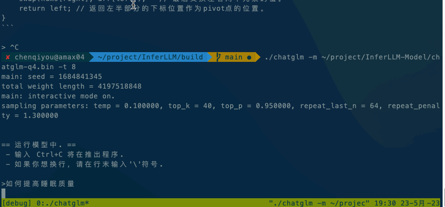
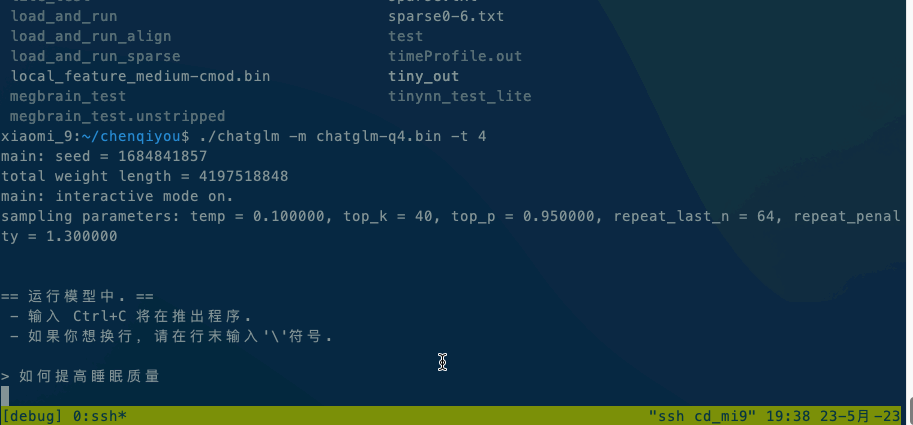

# InferLLM 
[中文 README](./README_Chinese.md)

InferLLM is a lightweight LLM model inference framework that mainly references and borrows from the llama.cpp project. llama.cpp puts almost all core code and kernels in a single file and use a large number of macros, making it difficult for developers to read and modify. InferLLM has the following features:

- Simple structure, easy to get started and learning, and decoupled the framework part from the kernel part.
- High efficiency, ported most of the kernels in llama.cpp.
- Defined a dedicated KVstorage type for easy caching and management.
- Compatible with multiple model formats (currently only supporting alpaca Chinese and English int4 models).
- Currently only supports CPU, mainly Arm and x86 platforms, and can be deployed on mobile phones, with acceptable speed.

In short, InferLLM is a simple and efficient LLM CPU inference framework that can deploy quantized models in LLM locally and has good inference speed.

## How to use
### Download model
Currently, InferLLM uses the same models as llama.cpp and can download models from the llama.cpp project. In addition, models can also be downloaded directly from Hugging Face [kewin4933/InferLLM-Model](https://huggingface.co/kewin4933/InferLLM-Model/tree/main). Currently, two alpaca models are uploaded in this project, one is the Chinese int4 model and the other is the English int4 model.

### Compile InferLLM
#### Local compilation
```shell
mkdir build
cd build
cmake ..
make
```
#### Android cross compilation
According to the cross compilation, you can use the pre-prepared tools/android_build.sh script. You need to install NDK in advance and configure the path of NDK to the NDK_ROOT environment variable.
```shell
export NDK_ROOT=/path/to/ndk
./tools/android_build.sh
```
### Run InferLLM
Running ChatGLM model please refer to [ChatGLM model documentation](./application/chatglm/Readme.md).

If it is executed locally, execute `./chatglm -m chatglm-q4.bin -t 4` directly. If you want to execute it on your mobile phone, you can use the adb command to copy alpaca and the model file to your mobile phone, and then execute `adb shell ./chatglm -m chatglm-q4.bin -t 4`. 
- x86 is：Intel(R) Xeon(R) CPU E5-2620 v4 @ 2.10GHz

- android is xiomi9，Qualcomm SM8150 Snapdragon 855


### supported model
Now InferLLM supports [ChatGLM-6B](https://github.com/THUDM/ChatGLM-6B), [llama](https://github.com/facebookresearch/llama), [alpaca](https://crfm.stanford.edu/2023/03/13/alpaca.html) models.
### License
InferLLM is licensed under the Apache License, Version 2.0

