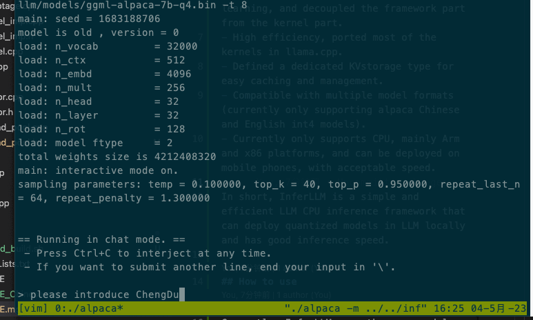
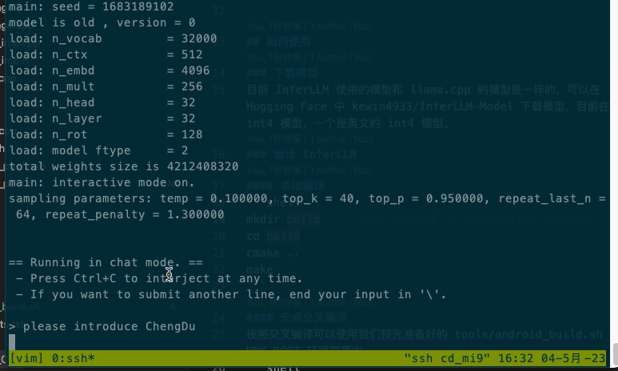

# InferLLM

InferLLM 是一个非常轻量的 LLM 模型推理框架，主要参考和借鉴了 llama.cpp 工程，llama.cpp 几乎所有核心代码和 kernel 都放在一两个文件中，并且使用了大量的宏，阅读和修改起来都很不方便，对开发者有一定的门槛。InferLLM 主要有以下特点：

- 结构简单，方便上手开发和学习，把框架部分和 Kernel 部分进行了解耦
- 运行高效，将 llama.cpp 中大多数的 kernel 都进行了移植
- 定义了专门的 KVstorage 类型，方便缓存和管理
- 可以兼容多种模型格式（目前只支持 alpaca 中文和英文的 int4 模型）
- 目前只支持 CPU，主要是 Arm 和 x86 平台，可以在手机上部署，速度在可以接受的范围

总之 InferLLM 是一个简单高效的 LLM CPU 推理框架，可以本地部署 LLM 中的量化模型，推理速度还不错。

## 如何使用
### 下载模型
目前 InferLLM 使用的模型和 llama.cpp 的模型是一样的，可以在 llama.cpp 工程中下载模型。另外也可以直接从 Hugging Face 中 [kewin4933/InferLLM-Model](https://huggingface.co/kewin4933/InferLLM-Model/tree/main) 下载模型，目前在这个工程中上传了两个 alpaca 的模型，一个是中的 int4 模型，一个是英文的 int4 模型。
### 编译 InferLLM
#### 本地编译
```shell
mkdir build
cd build
cmake ..
make
```
#### 安卓交叉编译
按照交叉编译可以使用我们预先准备好的 tools/android_build.sh 脚本，需要提前安装好 NDK, 并把 NDK 的路径配置到 NDK_ROOT 环境变量中。
```shell
export NDK_ROOT=/path/to/ndk
./tools/android_build.sh
```
### 运行 InferLLM
如果是本执行直接执行 `./alpaca -m chinese-alpaca-7b-q4.bin -t 4`，如果要在手机上执行，可以使用 adb 命令把 alpaca 和模型文件拷贝到手机上，然后执行 `adb shell ./alpaca -m chinese-alpaca-7b-q4.bin -t 4`。下面是运行时的截屏，
- x86 芯片是：Intel(R) Xeon(R) CPU E5-2620 v4 @ 2.10GHz
- 手机是 xiomi9，Qualcomm SM8150 Snapdragon 855
 

### License
InferLLM is licensed under the Apache License, Version 2.0
